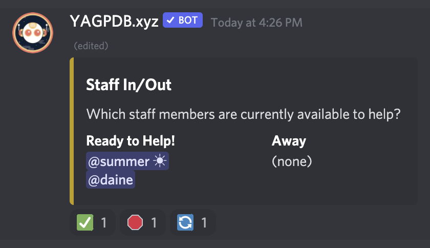

# Availability

## What is it?



A cute little embed that allows staff to mark whether they're available or away using reactions.

## How do I set it up?

Requires the [YAGPDB Discord bot](https://yagpdb.xyz).

Add the contents of the included files as Custom Commands in YAGPDB's dashboard. [`availabilityEmbed.go.tmpl`](availabilityEmbed.go.tmpl) should have `Trigger Type` of "Command" and be called `availabilityEmbed`. [`triggerAvailabilityUpdate.go.tmpl`](triggerAvailabilityUpdate.go.tmpl) should have `Trigger Type` "Reaction."

Update the following from the top of `triggerAvailabilityUpdate` to match whatever IDs these commands actually received in your YAGPDB dashboard when you created them:

```go
{{ $thisCmd := 2 }}
{{ $embedCmd := 1 }}
```

You can also adjust the appearance of the embed by changing the right-side options within the `settings` template at the top of `availabilityEmbed`.

To actually set up the embed, go to the channel you want it in and type `y!availabilityEmbed` where `y!` is the prefix for YAGPDB.

## How do I use it?

The first two emojis add the person who uses them to the available or away list. The last emoji resets the embed to its initial state.
