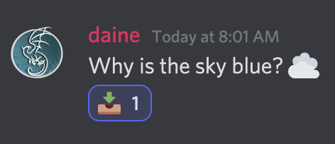
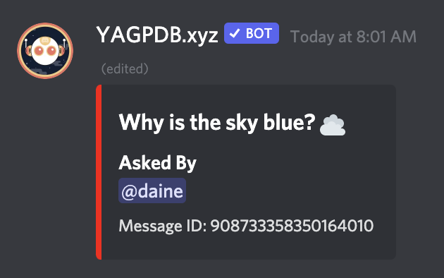
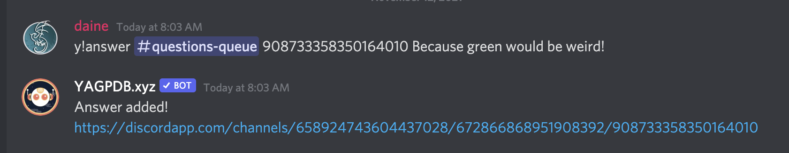
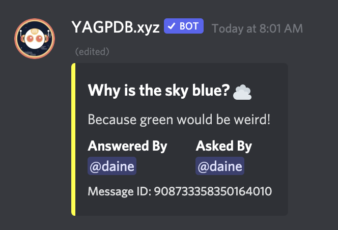
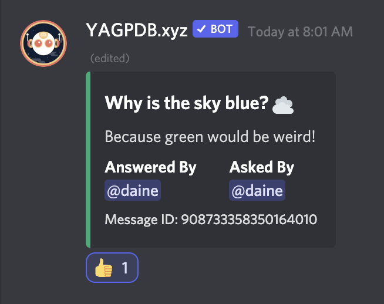
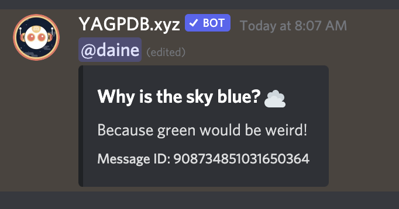

# Question and Answer

## What is it?

This set of commands enables a workflow for extracting questions to a queue where answers can be proposed, approved, and then broadcast to an F.A.Q. channel. The queue includes status markers to enable staff to identify which questions still need to be addressed. Broadcast answers can also be updated later on.

Walking through an example, first someone asks a question in a public `#contact-staff` channel. Staff determines that they need discuss the answer and/or that that questions merits addition to the F.A.Q., so they send it to the `#queue` by reacting to the question with 📥.



The resulting message in the `#queue` channel is formatted as a custom embed, and inlcudes the full content of the original question message as well as a label to show who asked the question (since this new message is sent by YAGPDB and not the original sender). The border of the embed is red to indicate `todo` status.



A member of staff can, from another channel, propose an answer to a queued question by running the `answer` command like:

```
answer #[CHANNEL_MENTION] <MESSAGE_ID> ANSWER
```

(Note that command examples show here leave off YAGPDB's prefix. Also, required arguments are shown in `<>` while optional arguments in `[]`, to match YAGPDB's own documentation.)

YAGPDB will respond with a link to the updated queued question.



Back in the `#queue` channel, we'd see that originally queued question embed has been edited, and now shows the proposed answer, a mention of _who_ proposed that answer, and a now yellow "progress" status border.



Other staff members can now show approval for the proposed answer by adding 👍 reactions to the queued question. (Note that all the various skin tone variations of the 👍 emoji are supported.) Once the number of approvals reaches a set threshold, the embed's border will turn green to indicate "ready" status.



A member of staff can broadcast the answered question to an `#faq` channel by adding a 📣 reaction in the `#queue` channel. This creates a new message showing the original question and the provided answer in an embed, and also mentions the original asker for visibility and notification.



Lastly, staff can move any queued question to the "done" status (shown by the default neutral border color) at any point by reacting with either a ✅ or ❌.

## Additional Commands and Features

- You can edit the "Asked By" field in the questions queue (and therefore change who will be notified of a broadcast answer) with the command `editAskedBy`

## How do I set it up?

1. In the YAGPDB dashboard for your server, go to the `Core/Custom Commands` panel
1. Create a new group of commands. Call it something like `Q&A`
1. Create new commands within this group, one for each of the files in the [`commands`](commands) directory. The required types and suggested names for the commands are included in comments at the top of each file
1. When you create a command, it's given an ID number. The commands in this set call each other and so need to know their own ID numbers and the IDs of other commands in the group. Edit the lines at the start of each command called `$thisCmd` and things like `$extractCmd` to match the actual IDs you end up with
